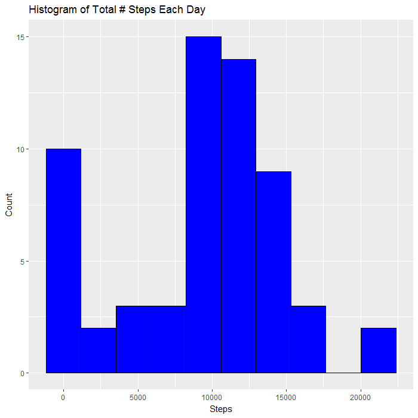
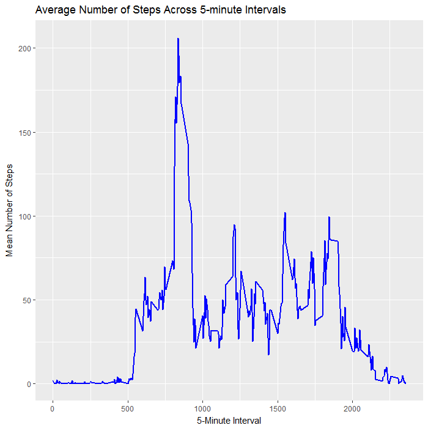
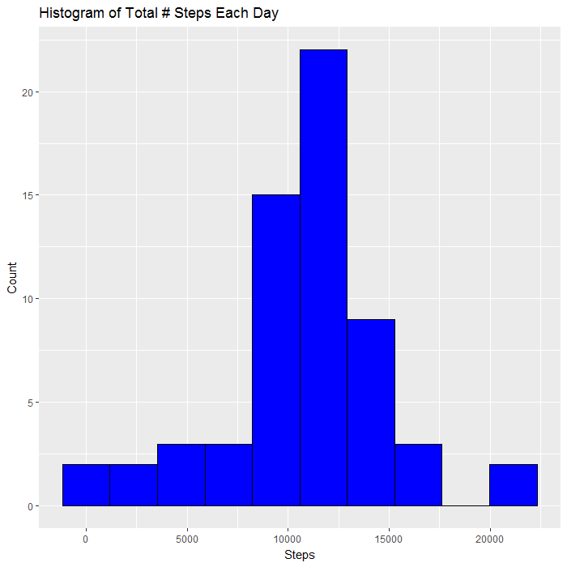
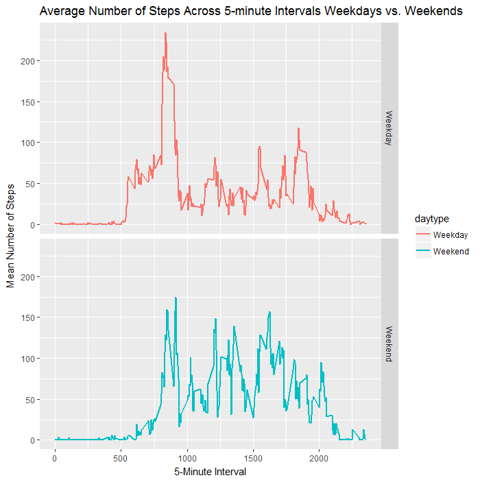
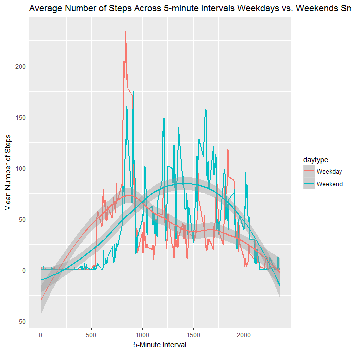

## Loading and preprocessing the data
### 1. Load the data (i.e. read.csv())

```r
library(plyr)
library(ggplot2)
options(scipen=999)

activity <- read.csv("activity.csv")
as_data_frame(activity)
```

```
## # A tibble: 17,568 × 3
##    steps       date interval
##    <int>     <fctr>    <int>
## 1     NA 2012-10-01        0
## 2     NA 2012-10-01        5
## 3     NA 2012-10-01       10
## 4     NA 2012-10-01       15
## 5     NA 2012-10-01       20
## 6     NA 2012-10-01       25
## 7     NA 2012-10-01       30
## 8     NA 2012-10-01       35
## 9     NA 2012-10-01       40
## 10    NA 2012-10-01       45
## # ... with 17,558 more rows
```

### 2. Process/transform the data (if necessary) into a format suitable for your analysis

```r
activity <- transform(activity, date = as.Date(as.character(date), "%Y-%m-%d"))
as_data_frame(activity)
```

```
## # A tibble: 17,568 × 3
##    steps       date interval
##    <int>     <date>    <int>
## 1     NA 2012-10-01        0
## 2     NA 2012-10-01        5
## 3     NA 2012-10-01       10
## 4     NA 2012-10-01       15
## 5     NA 2012-10-01       20
## 6     NA 2012-10-01       25
## 7     NA 2012-10-01       30
## 8     NA 2012-10-01       35
## 9     NA 2012-10-01       40
## 10    NA 2012-10-01       45
## # ... with 17,558 more rows
```

```r
summary(activity)
```

```
##      steps             date               interval     
##  Min.   :  0.00   Min.   :2012-10-01   Min.   :   0.0  
##  1st Qu.:  0.00   1st Qu.:2012-10-16   1st Qu.: 588.8  
##  Median :  0.00   Median :2012-10-31   Median :1177.5  
##  Mean   : 37.38   Mean   :2012-10-31   Mean   :1177.5  
##  3rd Qu.: 12.00   3rd Qu.:2012-11-15   3rd Qu.:1766.2  
##  Max.   :806.00   Max.   :2012-11-30   Max.   :2355.0  
##  NA's   :2304
```

```r
dim(activity)
```

```
## [1] 17568     3
```

```r
head(activity)
```

```
##   steps       date interval
## 1    NA 2012-10-01        0
## 2    NA 2012-10-01        5
## 3    NA 2012-10-01       10
## 4    NA 2012-10-01       15
## 5    NA 2012-10-01       20
## 6    NA 2012-10-01       25
```


## What is mean total number of steps taken per day?
For this part of the assignment, you can ignore the missing values in the dataset.
### 1. Make a histogram of the total number of steps taken each day

```r
total_steps <- ddply(activity, .(date), summarize, total = sum(steps, na.rm = TRUE))
as_data_frame(total_steps)
```

```
## # A tibble: 61 × 2
##          date total
##        <date> <int>
## 1  2012-10-01     0
## 2  2012-10-02   126
## 3  2012-10-03 11352
## 4  2012-10-04 12116
## 5  2012-10-05 13294
## 6  2012-10-06 15420
## 7  2012-10-07 11015
## 8  2012-10-08     0
## 9  2012-10-09 12811
## 10 2012-10-10  9900
## # ... with 51 more rows
```

```r
ggplot(total_steps, aes(x = total)) + 
  geom_histogram(bins = 10, fill = "blue", col = "black") + 
  ggtitle("Histogram of Total # Steps Each Day") + 
  xlab("Steps") + 
  ylab("Count")
```


### 2. Calculate and report the mean and median total number of steps taken per day

```r
mean_steps <- mean(total_steps$total)
median_steps <- median(total_steps$total)
```

* **Mean** of total number of steps per day: 9354
* **Median**  of total number of steps per day: 10395

## What is the average daily activity pattern?
### 1. Make a time series plot (i.e. type = "l") of the 5-minute interval (x-axis) and the average number of steps taken, averaged across all days (y-axis)

```r
activity_by_interval <- aggregate(steps ~ interval, activity, mean, na.rm = TRUE)
as_data_frame(activity_by_interval)
```

```
## # A tibble: 288 × 2
##    interval     steps
##       <int>     <dbl>
## 1         0 1.7169811
## 2         5 0.3396226
## 3        10 0.1320755
## 4        15 0.1509434
## 5        20 0.0754717
## 6        25 2.0943396
## 7        30 0.5283019
## 8        35 0.8679245
## 9        40 0.0000000
## 10       45 1.4716981
## # ... with 278 more rows
```

```r
ggplot(activity_by_interval, aes(x = interval, y = steps)) + 
  geom_line(col = "blue", lwd = 1) + 
  ggtitle("Average Number of Steps Across 5-minute Intervals") + 
  xlab("5-Minute Interval") + 
  ylab("Mean Number of Steps")
```




### 2. Which 5-minute interval, on average across all the days in the dataset, contains the maximum number of steps?

```r
max_steps_interval <- activity_by_interval$interval[which.max(activity_by_interval$steps)]
```
5-minute interval with maximum number of average steps: 835

## Imputing missing values
Note that there are a number of days/intervals where there are missing values (coded as NA). The presence of missing days may introduce bias into some calculations or summaries of the data.

### 1. Calculate and report the total number of missing values in the dataset (i.e. the total number of rows with NAs)
* **Which columns have NAs?**:

```r
apply(apply(activity, 2, is.na), 2, any)
```

```
##    steps     date interval 
##     TRUE    FALSE    FALSE
```
* **How many NAs does each column have?**:

```r
apply(apply(activity, 2, is.na), 2, sum)
```

```
##    steps     date interval 
##     2304        0        0
```

### 2. Devise a strategy for filling in all of the missing values in the dataset. The strategy does not need to be sophisticated. For example, you could use the mean/median for that day, or the mean for that 5-minute interval, etc.
* I computed the average number of steps by date and then also by interval. Since some days had NAs for the entire day, I set those in particular to the mean of all of the steps over all days and intervals. 

```r
activity_model_data <- transform(activity, meanPerDate = ave(steps, date, FUN=function(x) mean(x, na.rm=T)))
activity_model_data <- transform(activity_model_data, meanPerInterval = ave(steps, interval, FUN=function(x) mean(x, na.rm=T)))
activity_model_data$meanPerDate[is.na(activity_model_data$meanPerDate)] = mean(activity$steps, na.rm = TRUE)
```

* I then fit a linear model with the steps using the average per day and interval. 

```r
activity_model <- lm(steps ~ meanPerInterval + meanPerDate, activity_model_data)
```

* As expected, the model basically found me an intercept that allowed me to sum over the averages to get an estimate for the missing value. 

```r
summary(activity_model)
```

```
## 
## Call:
## lm(formula = steps ~ meanPerInterval + meanPerDate, data = activity_model_data)
## 
## Residuals:
##     Min      1Q  Median      3Q     Max 
## -242.38  -42.17  -15.32    2.93  745.76 
## 
## Coefficients:
##                  Estimate Std. Error t value            Pr(>|t|)    
## (Intercept)     -37.38260    2.44521  -15.29 <0.0000000000000002 ***
## meanPerInterval   1.00000    0.02183   45.80 <0.0000000000000002 ***
## meanPerDate       1.00000    0.05739   17.42 <0.0000000000000002 ***
## ---
## Signif. codes:  0 '***' 0.001 '**' 0.01 '*' 0.05 '.' 0.1 ' ' 1
## 
## Residual standard error: 104.1 on 15261 degrees of freedom
##   (2304 observations deleted due to missingness)
## Multiple R-squared:  0.136,	Adjusted R-squared:  0.1359 
## F-statistic:  1201 on 2 and 15261 DF,  p-value: < 0.00000000000000022
```

### 3. Create a new dataset that is equal to the original dataset but with the missing data filled in.

```r
activity_model_data$steps <- apply(activity_model_data, 1, function(X, model) {
  if(is.na(X["steps"])) {
    value <- as.numeric(activity_model$coefficients[1]) + 
          as.numeric(X["meanPerDate"]) + 
          as.numeric(X["meanPerInterval"])
    
    # can't have fractional steps
    value <- round(value)
    
    # can't have negative steps
    value <- max(value, 0)
    
    return(value)
  } else {
    return(as.numeric(X["steps"]))
  }
}, activity_model) 

activity_filled <- activity_model_data[,1:3]
as_data_frame(activity_filled)
```

```
## # A tibble: 17,568 × 3
##    steps       date interval
##    <dbl>     <date>    <int>
## 1      2 2012-10-01        0
## 2      0 2012-10-01        5
## 3      0 2012-10-01       10
## 4      0 2012-10-01       15
## 5      0 2012-10-01       20
## 6      2 2012-10-01       25
## 7      1 2012-10-01       30
## 8      1 2012-10-01       35
## 9      0 2012-10-01       40
## 10     1 2012-10-01       45
## # ... with 17,558 more rows
```

### 4. Make a histogram of the total number of steps taken each day and Calculate and report the mean and median total number of steps taken per day.

```r
total_steps_filled <- ddply(activity_filled, .(date), summarize, total = sum(steps, na.rm = TRUE))
as_data_frame(total_steps_filled)
```

```
## # A tibble: 61 × 2
##          date total
##        <date> <dbl>
## 1  2012-10-01 10762
## 2  2012-10-02   126
## 3  2012-10-03 11352
## 4  2012-10-04 12116
## 5  2012-10-05 13294
## 6  2012-10-06 15420
## 7  2012-10-07 11015
## 8  2012-10-08 10762
## 9  2012-10-09 12811
## 10 2012-10-10  9900
## # ... with 51 more rows
```

```r
ggplot(total_steps_filled, aes(x = total)) + 
  geom_histogram(bins = 10, fill = "blue", col = "black") + 
  ggtitle("Histogram of Total # Steps Each Day") + 
  xlab("Steps") + 
  ylab("Count")
```




```r
mean_steps_filled <- mean(total_steps_filled$total)
median_steps_filled <- median(total_steps_filled$total)
```

* **Values from Before**:
 * **Mean** of total number of steps per day: 9354
 * **Median**  of total number of steps per day: 10395
* **New values after imputation:**
 * **Mean** of total number of steps per day: 10766
 * **Median**  of total number of steps per day: 10762

#### Do these values differ from the estimates from the first part of the assignment? What is the impact of imputing missing data on the estimates of the total daily number of steps?
Yes, these values are different. By using the mean to estimate the unknown data, it has increased the mean and median of the total number of steps. The NAs could have been 0s or small values. The mean is now much closer to the median. 

## Are there differences in activity patterns between weekdays and weekends?
* First we need to create a column to define whether the day is a weekday or a weekend. 

```r
activity_daytype <- mutate(activity, daytype = ifelse(weekdays(date) %in% c("Saturday", "Sunday"), "Weekend", "Weekday"))
activity_daytype$daytype = as.factor(activity_daytype$daytype)
```
* Now compute the average and plot it

```r
activity_daytype_average <- ddply(activity_daytype, .(daytype, interval), summarize, average = mean(steps, na.rm = TRUE))
ggplot(activity_daytype_average, aes(x = interval, y = average, col = daytype)) + 
  geom_line(lwd = 1) + 
  ggtitle("Average Number of Steps Across 5-minute Intervals Weekdays vs. Weekends") + 
  xlab("5-Minute Interval") + 
  ylab("Mean Number of Steps") + 
  facet_grid(daytype ~ .)
```


* Plot again with smoothing:


```r
activity_daytype_average <- ddply(activity_daytype, .(daytype, interval), summarize, average = mean(steps, na.rm = TRUE))
ggplot(activity_daytype_average, aes(x = interval, y = average, col = daytype)) + 
  geom_line(lwd = 1) + 
  ggtitle("Average Number of Steps Across 5-minute Intervals Weekdays vs. Weekends Smoothed") + 
  xlab("5-Minute Interval") + 
  ylab("Mean Number of Steps") + 
  geom_smooth()
```

```
## `geom_smooth()` using method = 'loess'
```



The smoothed plot shows much more clearly that the subject tends to be more active earlier in the day on weekdays relative to weekends, and more active later in the day on weekends relative to weekdays. 
